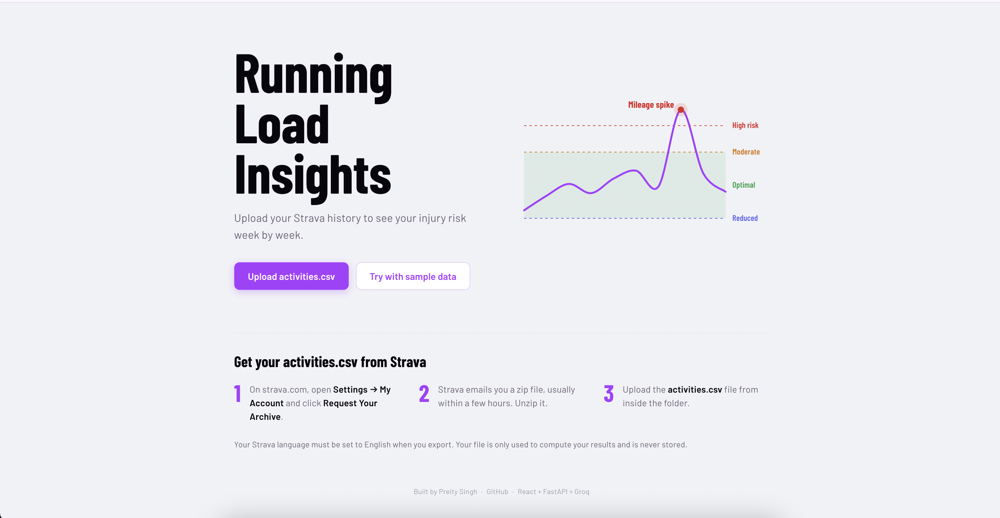
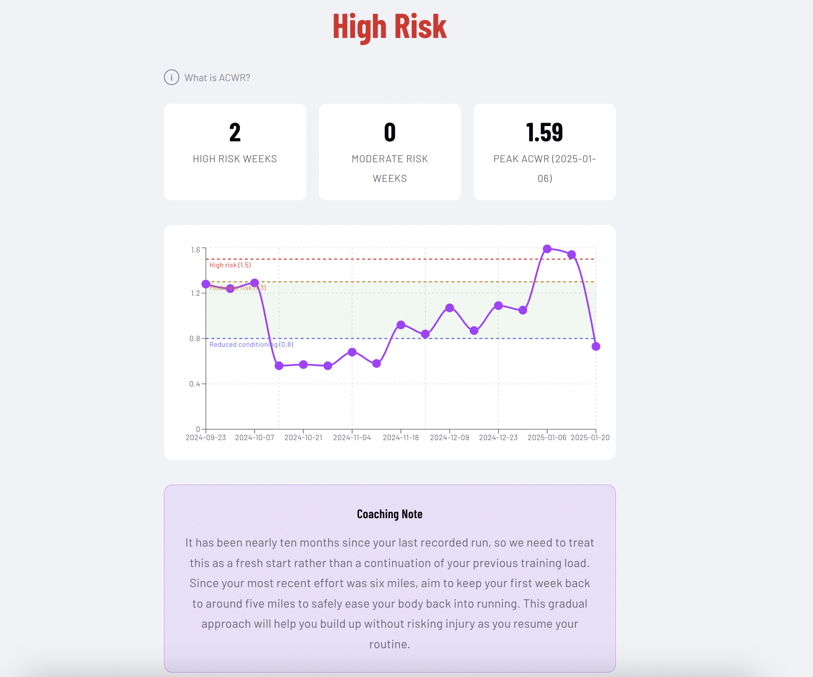
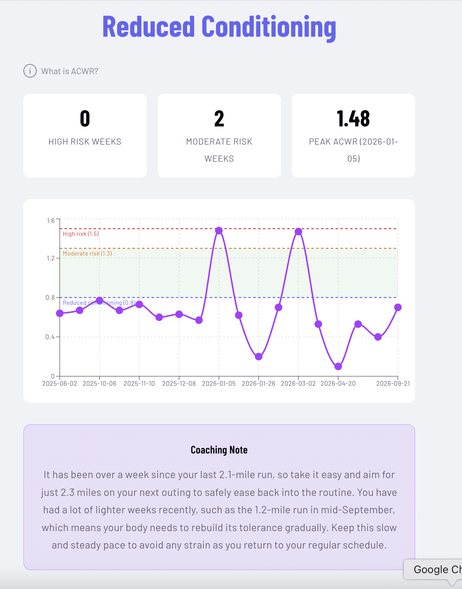
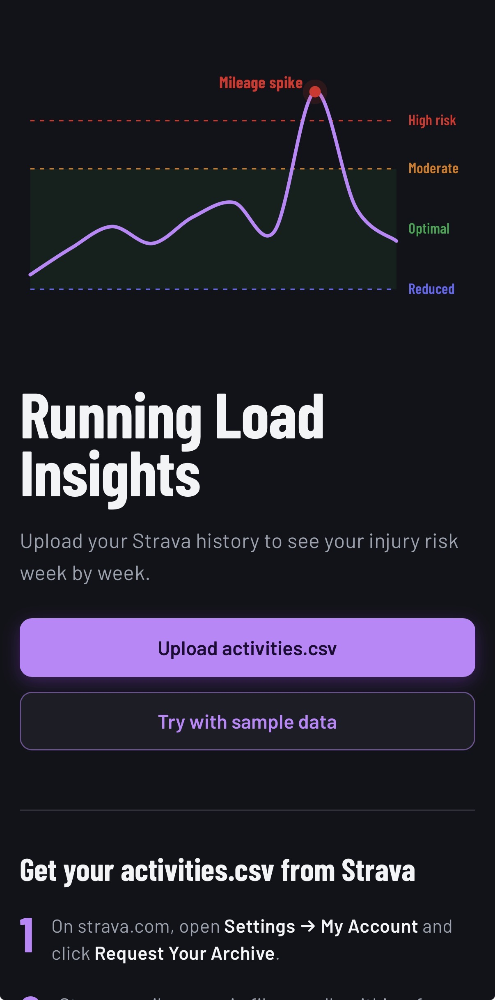

# Running Load Insights

Upload your Strava history to see your injury risk week by week: how your running load has shifted over time, which weeks spiked too fast, and a personalized coaching note on what to do next.

**Live app:** [running-load-insights.vercel.app](https://running-load-insights.vercel.app). Click "Try with sample data" to see it without uploading anything.



## The Problem

Runners increase mileage too quickly all the time and often without realizing it, especially after a break. This is one of the most common causes of running injuries, and it's invisible unless you're tracking it deliberately.

## The Approach: ACWR

This tool is built around **Acute:Chronic Workload Ratio (ACWR)**, a sports-science metric that compares your current week's mileage to a weighted average of your recent history. Recent weeks count more, old weeks fade gradually, and a chronic floor prevents the math from overreacting to low mileage. The ratio matters more than absolute mileage — a spike is relative to what your body has recently been doing.


### Risk Bands

| Band | ACWR | What it means |
|------|------|--------------|
| High Risk | ≥ 1.5 | Sharp spike — significant injury risk |
| Moderate Risk | 1.3 – 1.49 | Load rising faster than ideal |
| Optimal | 0.8 – 1.3 | Well-balanced training |
| Reduced Conditioning | < 0.8 | Below baseline — be gradual if ramping up |

Inactive weeks (0 miles) produce no ratio and appear as gaps in the chart — the chronic average decays during breaks so your first week back is assessed relative to your actual recent baseline, not an inflated one.

### Per-Week Insights

Hover over any data point to see the ACWR value, risk band, mileage context, and a concrete coaching note with specific mileage targets:

| Band | Example |
|------|---------|
| Moderate Risk |  |
| Reduced Conditioning |  |
| Reduced Conditioning (Floor) |  |

## Full Dashboard

The dashboard shows your current risk status, summary stats, an interactive ACWR timeline with labeled thresholds and a shaded Optimal zone, and an LLM-generated coaching note with forward-looking guidance.



With my own Strava export:



## How It Works

```
User uploads activities.csv from Strava's free data export (or tries the sample data)
  → Backend parses runs from the export
  → Python computes weekly mileage, fills gaps, calculates ACWR per week
  → Groq LLM generates a coaching note from the pre-computed data
  → React dashboard displays risk summary, timeline chart, and note
```

The LLM never performs any calculation — it only narrates results that were already computed deterministically. This is intentional: ACWR thresholds and mileage numbers need to be guaranteed accurate, not hallucinated.

## Dark Mode & Mobile

Fully responsive and follows your system's light or dark mode:

<p align="center">
  
</p>

## Tech Stack

- **Backend:** FastAPI (Python) — CSV parsing, pipeline orchestration
- **Metrics:** Custom Python — weekly aggregation, gap-filling, EWMA-based ACWR with chronic floor
- **LLM:** Groq — coaching note generation from pre-computed metrics
- **Frontend:** React (Vite) + Recharts
- **Deployment:** Vercel Services (frontend + backend in one project, free Hobby plan)

## Why EWMA Over Rolling Average

The standard way to calculate ACWR uses a simple rolling average: add up the last 4 weeks and divide by 4. The problem is that week 5 data drops from full influence to zero overnight — a "cliff" that doesn't reflect how fitness actually works. Your body doesn't forget a 15-mile week the instant it's 29 days old.

EWMA (Exponentially Weighted Moving Average) fixes this by decaying old weeks gradually:

```
chronic = (this_week × 0.4) + (previous_chronic × 0.6)
```

Each week, 40% of the weight goes to the new data and 60% carries forward from before. A big week from a month ago still contributes about 13% of its original influence (0.6⁴ ≈ 0.13) rather than disappearing entirely. This produces smoother, more realistic baselines — especially for runners with inconsistent schedules.

### Chronic Floor (3.0 miles)

Without a floor, the math breaks for low-volume runners. If someone averages 1 mile/week and then runs 3 miles, a pure ratio gives ACWR = 3.0 (extreme high risk) — but 3 miles isn't dangerous for anyone regardless of history. The chronic floor caps the denominator at 3.0 miles minimum, so the ratio stays grounded in reality when absolute mileage is too low to cause injury.

## Why ACWR Over TSB

TSB (Training Stress Balance) is what TrainingPeaks uses — it relies on power/pace zones and workout-level stress scores that require either a power meter or accurate pace data with a known fitness threshold. For casual runners tracking only distance and time, those inputs don't exist without calibration. ACWR works with raw mileage alone, making it accessible to any runner with a GPS watch or smartphone. The tradeoff is less precision at high performance levels, but for injury-risk detection in recreational runners, the spike-vs-baseline signal is what matters.

## Running Locally

**Backend:**
```bash
cd backend
pip install -r requirements.txt
python3 -m uvicorn main:app --reload --port 8000
```

**Frontend:**
```bash
cd frontend
npm install
npm run dev
```

Vite proxies `/api/*` to the backend on port 8000, matching production routing. Alternatively, run both with `vercel dev` from the repo root.

Copy `.env.example` to `.env` and add a free Groq key from [console.groq.com](https://console.groq.com).

## Deployment

One Vercel project deploys both services (see `vercel.json`): the React app serves `/` and FastAPI serves `/api/*` as a serverless function, so there's no always-on server to pay for or put to sleep. Auto-deploys on git push.

Environment variable: `GROQ_API_KEY`.

## Project History: v1 → v2

### v1: Strava API + Railway

The first version let runners click "Connect with Strava" and pulled their activities straight from the Strava API. The React frontend was hosted on Vercel and the FastAPI backend on Railway.

```
User clicks "Connect with Strava"
  → OAuth login via Strava
  → Backend fetches activity history
  → Python computes weekly mileage, fills gaps, calculates ACWR per week
  → Groq LLM generates a coaching note from the pre-computed data
  → React dashboard displays risk summary, timeline chart, and note
```

This is what v1 looked like:


<p align="center">
  
  &nbsp;&nbsp;
  
  &nbsp;&nbsp;
  
</p>

### Why it changed

I want this app to be free to run forever, and to never "fall asleep" the way free Streamlit or Render apps do. In September 2026, v1 stopped meeting that goal for two reasons:

- **Railway's free trial ended**, so the backend had nowhere free to live.
- **Strava put its API behind a paid subscription** (June 2026). "Connect with Strava" only works for developers with an active subscription.

### v2: what it is now

v2 is the version shown at the top of this README. Runners upload the `activities.csv` file from Strava's free data export (or try the built-in sample data), and the whole app runs as one free Vercel project. I also redesigned the home page and moved the app to a single, consistent style.

| | v1 | v2 (current) |
|---|---|---|
| **Data source** | Strava OAuth API ("Connect with Strava") | Strava's free bulk export (`activities.csv` upload) + built-in sample data |
| **Hosting** | Vercel (frontend) + Railway (backend) | One Vercel project using Vercel Services |
| **Backend** | Always-on server on Railway | Serverless function: nothing to keep running, nothing to fall asleep |
| **Cost** | Railway trial + paid Strava subscription | Free (Vercel Hobby plan, free Groq key) |
| **LLM** | Groq `compound-mini` | Groq `qwen3.8-27b` (`compound-mini` was retired) |

The core of the app didn't change: the weekly mileage aggregation, the EWMA-based ACWR with a chronic floor, the risk bands, and the "LLM narrates, never calculates" coaching note. The CSV parser converts Strava's export into the same shape the API used to return, so the metrics code runs unchanged on either source.

### Restoring v1

The v1 code is preserved at the [`strava-oauth-version`](https://github.com/preity-singh/running-load-insights/tree/strava-oauth-version) tag. The OAuth flow is also still in the current code, switched off. To re-enable it, set `STRAVA_ENABLED=true`, `STRAVA_CLIENT_ID`, `STRAVA_CLIENT_SECRET`, `BACKEND_URL=https://<your-domain>/api` and `FRONTEND_URL=https://<your-domain>` on the backend, `VITE_STRAVA_ENABLED=true` on the frontend, and point Strava's Authorization Callback Domain to your Vercel domain.

## What's Next

**Account for elevation with Grade Adjusted Distance.** Right now ACWR counts every mile the same, but a hilly 3-mile run puts more strain on your body than a flat one. Strava's export already includes a Grade Adjusted Distance for each run: its estimate of what that run would equal on flat ground, based on the climbing and descending. Using it in place of raw distance would let hill-heavy weeks count as the extra load they really are, so a week of hill repeats can show up as a spike even when the mileage looks normal.

---

Built by [Preity Singh](https://www.linkedin.com/in/preity-singh/) · [GitHub](https://github.com/preity-singh)
